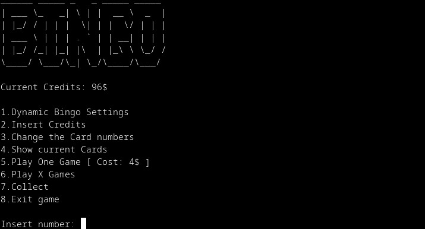
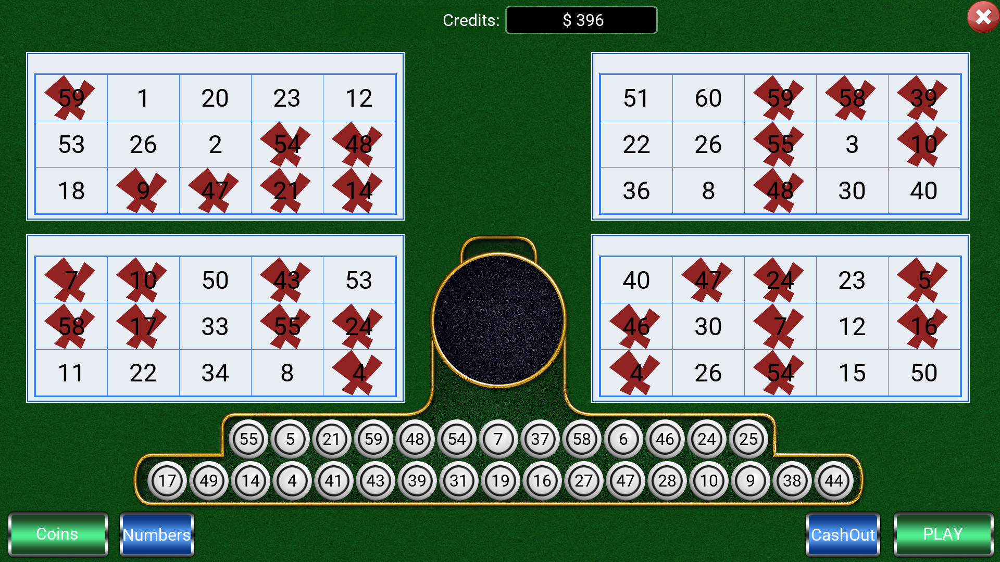

# Bingo

|Project|Build|
|-------|-----|
| Core | [](https://github.com/yatima1460/Bingo/actions) |
| Core Test | [](https://github.com/yatima1460/Bingo/actions) |
| CLI | [](https://github.com/yatima1460/Bingo/actions) |
| UI | [](https://github.com/yatima1460/Bingo/actions) |

## CLI



- Dynamic Bingo settings
  - Prize patterns add
  - ~Prize patterns delete~
  - ~Number of balls~
  - ~Number of cards~
  - ~Card size~
- Game Statistics
  - Percentage Game
  - Pattern frequency
  - Contribution patterns
- ~Insert credits~
- ~Change numbers~
- ~Show current cards~
- ~Play One Game~
  - ~Show ExtractedBalls balls~
  - ~Show cards status~
  - ~Show prizes~
  - ~Remaining credits~
- ~Play X Games~
- ~collect~
- ~Exit game~
- Functions to print cards should be merged into one
- ncurses?

## UI



- ~Background~
- ~balls ExtractedBalls~
- ~Cartons~
  - ~Marked~
- Buttons
  - ~Enter money~
  - ~collect money~
    - ~Disable if no money~
  - ~Change Cardboard numbers~
  - ~Play Game~
    - ~Remove credits for cards~
    - ~Update screen~
    - ~Give prizes~
    - ~Disable if no money for cards~
  - Mute audio
- ~Current credits~
- ~Exit with ESC~
- SDL_Image support for .png?
- Resize window buffer using renderToTexture
- ~Disabled button~
- Font size
- Sounds and effects
- ~Assets loader with associative string->Texture map?~
- balls different colors

## Build

### Prerequisites

#### Core and CLI

- CMake
- g++

#### UI


##### Debian
```
sudo apt install -y libsdl2-dev libsdl2-ttf-dev
```

##### Arch
```
sudo pacman -S sdl2 sdl2_ttf
```


## System used:

```
                   -`                    yatima1460@arch-desktop 
                  .o+`                   ----------------------- 
                 `ooo/                   OS: Arch Linux x86_64 
                `+oooo:                  Kernel: 4.19.75-1-lts 
               `+oooooo:                 Uptime: 1 hour, 16 mins 
               -+oooooo+:                Packages: 1102 (pacman) 
             `/:-:++oooo+:               Shell: bash 5.0.9 
            `/++++/+++++++:              Resolution: 1920x1080, 1366x768 
           `/++++++++++++++:             DE: Xfce 
          `/+++ooooooooooooo/`           WM: Xfwm4 
         ./ooosssso++osssssso+`          WM Theme: Default 
        .oossssso-````/ossssss+`         Theme: Adwaita [GTK2], deepin [GTK3] 
       -osssssso.      :ssssssso.        Icons: Papirus-Light [GTK2], deepin [G 
      :osssssss/        osssso+++.       Terminal: xfce4-terminal 
     /ossssssss/        +ssssooo/-       Terminal Font: Noto Sans Mono Light 11 
   `/ossssso+/:-        -:/+osssso+-     CPU: AMD FX-8350 (8) @ 4.000GHz 
  `+sso+:-`                 `.-/+oso:    GPU: NVIDIA GeForce GTX 980 Ti 
 `++:.                           `-/+/   Memory: 5712MiB / 16002MiB 
 .`                                 `/
```

## Software used:

```
CLion 2019.2.3
g++ (GCC) 9.1.0
```
